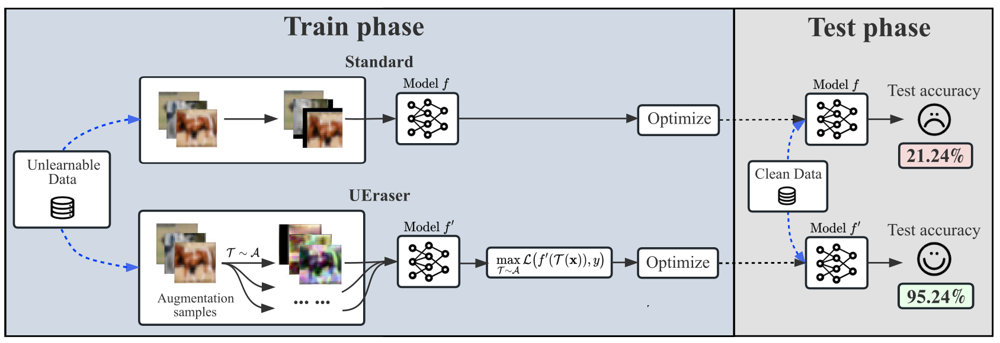

# Learning the unlearnable (UEraser)
This repository contains the code of paper "Learning the unlearnable: Adversarial augmentations suppress unlearnable example attacks".


### General Usage of UEraser
```python
import torch
import torchvision as tv
from UEraser_func import adversarial_augmentation_loss
# model
model = ...  # a PyTorch model
# optimizer
optimizer = torch.optim.SGD(
    model.parameters(), lr=0.1, momentum=0.9, weight_decay=5e-4)
dataset = ...  # an unlearnable dataset
dataloader = torch.utils.data.DataLoader(
    dataset, batch_size=128, shuffle=True, num_workers=2)
max_epochs = 200  # the number of total training epochs
aa_epochs = 60  # the number of epochs for adversarial augmentations
repeat = 5  # The number of repeated sampling
# UEraser
for e in range(max_epochs):
    for images, labels in dataloader:
        optimizer.zero_grad()
        images, labels = images.to(device), labels.to(device)
        r = repeat if e < aa_epochs else 1
        loss = adversarial_augmentation_loss(model, images, labels, r)
        loss.backward()
        optimizer.step()
```

### Requirements:
Please first install python>=3.10 and the following packages:
```bash
pip install torch numpy kornia scikit-learn einops
```

### Quick start:
We provide an example of UEraser on CIFAR-10 poisons generated by [EM](https://github.com/HanxunH/Unlearnable-Examples) and
[LSP](https://github.com/dayu11/Availability-Attacks-Create-Shortcuts).

#### EM:
The detailed instructions are available in [`EM/QuickStart.ipynb`](EM/QuickStart.ipynb).

#### LSP:
Go to LSP subfolder：
```bash
cd LSP/
```
Here are some example commands to test UEraser on LSP poisons.

Classification performance of UEraser when training on LSP CIFAR-10 with ResNet18:
```bash
CUDA_VISIBLE_DEVICES=0 python cifar_train.py --model <model> --dataset <dataset> --mode <mode> --type <type>
```
The parameter choices for the above commands are as follows:
- Dataset `<dataset>`: `c10` , `c100`, `svhn`.
- Model `<model>`: `resnet18`, `resnet50`, `densenet`.
- Mode of UEraser `<mode>`: `fast`, `standard`, `em`.
- Clean `<clean>`: `unlearn`, `clean`.

### Acknowledgement:

Training code adapted from EM and LSP repository [EM-repository](https://github.com/HanxunH/Unlearnable-Examples) and [LSP-repository](https://github.com/dayu11/Availability-Attacks-Create-Shortcuts).
